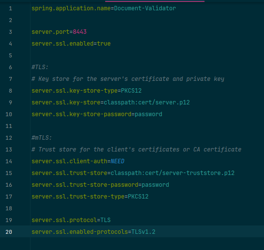

# Документација -  Сервер за валидација на документи со сертификати и mTLS - Борис Џотов 185022

Линк до GitHub од проектот со mTLS и креирање на кориснички профили со верификација на мејл: [https://github.com/borisdz/Document-Validation-Server/tree/master](https://github.com/borisdz/Document-Validation-Server/tree/master)

Линк до GitHub од проектот само со mTLS: [https://github.com/borisdz/Document-Validation-Server/tree/only-mtls](https://github.com/borisdz/Document-Validation-Server/tree/only-mtls) 

На првиот линк е поставен кодот како што ми беше замислена апликацијата целосно, но не функционира само login методот од сервисот за автентикација, па може само да се пристапи со сертификат и да се регистрира нов корисник, не може да се најави и да стигне до `/document`.

Овој проект претставува изработка на сервер за валидација на документи според сертификатот со кој што истиот е потпишан.

На серверот исто така има конфигурирано и mTLS (mutual Transport Layer Security). mTLS претставува метод на взаемна автентикација. mTLS се грижи двата корисника или корисник-сервер во мрежата да се оние кои се претставуваат дека се, со тоа што двете страни треба да го имаат коректниот приватен клуч. Информациите кои ги содржат TLS сертификатите соодветно пружаат дополнителна верификација.

mTLS најчесто се користи во Zero Trust security framework да се верифицираат корисници, уреди и сервери во една организација. Оваа рамка всушност значи дека ниеден корисник, уред или проток во мрежата не е веродостоен.

## mTLS конфигурација во Spring Boot веб апликацијата

### Генерирање на потребни клучеви, сертификати и trust stores

```
keytool -genkeypair -alias server -keyalg RSA -keysize 4096 -validity 365 -dname "CN=Server_185022,OU=IB,O=FINKI,L=Skopje,S=SK,C=MK" -keypass password -keystore server.p12 -storeType PKCS12 -storepass password

keytool -genkeypair -alias client -keyalg RSA -keysize 4096 -validity 365 -dname "CN=Client_185022,OU=IB,O=FINKI,L=Skopje,S=SK,C=MK" -keypass password -keystore client.p12 -storeType PKCS12 -storepass password

```

Со двете команди погоре, се генерира фајл `server.p12` и `client.p12` кои содржат пар од јавен и приватен клуч кои се валидни една година. Се користи алгоритамот RSA со големина на клуч - 4096 бити (може да биде од 2048 до 4096 бити). Другите делови од командата се потребни податоци за сертификатот и клучевите.

```
// export public keys
keytool -exportcert -alias client -file client.cer -keystore client.p12 -storepass password

keytool -exportcert -alias server -file server.cer -keystore server.p12 -storepass password

```

Тука се експортираат јавните клучеви во сертификатите `client.cer` и `server.cer` соодветно, па потоа подолу истите се импортираат во trust stores.

```
//import public keys to trust stores
keytool -importcert -keystore client-truststore.p12 -alias server-public -file server.cer -storepass password -noprompt

keytool -importcert -keystore server-truststore.p12 -alias client-public -file client.cer -storepass password -noprompt

```

Појаснување на некои од поимите:

- CA (Certificate Authority) - Ентитет кој издава дигитални сертификати.
- Certificate - Дигитална форма на идентификација, како пасош, за апликацијата.
- Private Key - Таен клуч кој се користи заедно со јавниот сертификат за да се енкриптиратат и декриптираат податоците.
- Truststore - репозиториум кој ги содржи сертификатиет на кои им се верува (обично СА сертификати).
- Keystore - репозиториум кој ги содржи сертификаттие заедно со нивните приватни клучеви.

### mTLS конфигурација во application properties и config

Следно треба да се овозможи mTLS енкрипција во апликацијата. Тоа го правиме во `application.properties` во `src/main/java/resources`. Содржината на тој фајл изгледа вака:



Објаснување по линии:

- 3: Овде се поставува порта на која ќе може да пристапиме до серверот.
- 4: Овде се прави enable на SSL, односно се овозможува користење на SSL протоколот.
- 8-10: Овде се поставуваат параметрите/податоците за серверските сертификати и клучеви. Тип на key store - PKCS12, патека до фајлот `server.p12` (сите сертификати и направени фајлови од погоре ми се ставени во `src/main/java/resources/cert` до каде може да се пристапи со `claspath:` од тековниот фајл), и на крај password за пристапување до trust store-от кој претходно го поставивме со командите погоре.
- 14-17: Овде се прави исто како за серверот, овој пат за клиент. На 14-та линија се поставува секогаш да се бара автентикација од страна на клиентот, односно да мора да прикаже сертификат при пристапување до страната. Потоа се патека до серверскиот trust store, соодветната лозинка за пристапување до истиот.
- 19 и 20та линија се поставува протокол на комуникација - `TLS` и верзија на протоколот - `TLSv1.2`.
Според зададената конфигурација, веб апликацијата ќе не носи секогаш на страната за пријавување/регистрирање. За да се олесни демонстрацијата и да избегнам правење база на корисници ова го заобиколив со `SecurityFilterChain`:


Ова само ги оневозможува логин страната и по одбирање на сертификат не носи директно на `https://localhost:8443/`.
Пристапувањето до странта изгледа вака:


Добиваме прозорче за да избереме сертификат, од каде го избираме Клиент сертификатот кој го креиравме претходно и го инсталиравме на нашиот компјутер (`windows+R->mmc->certificates`). По избирање на валидниот сертификат нѝ е овозможен пристап до страната и не води на почетната односно `/`.


Катанчето има `!` затоа што серверскиот сертификат ни е self-signed.

Следно е конфигурацијата за читање на документи и валидирање на истите.

## Кориснички профили со верификација на корисничката електронска пошта

За да го направам ова прво, ги додадов потребните dependencies во `pom.xml` :


Зависности за базата на податоци - користев `PostgreSQL`, `Spring JPA` и `Spring Boot Starter Mail` за да може да се испраќа елекронска пошта до корисниците.

### Поставување на `application.properties`

Следно се конфигурираат поставките на апликацијата - `application.properties` за да може да се користат сервисите за мејл и бази на податоци:


- Овде прво се подесуваат поставките за сервисот за електронска пошта, `host` кој го користев е `gmail` , порта на која слуша `smtp` протоколот, корисничката сметка на `gmail` од која ќе се праќаат електронската пошта, лозинка која ја генерирав на страната на `gmail` која ја користам само овде. Исто така се подесува да се користи автентикација и `tls` протокол за поштата.
- За базата на податоци имам стандардни поставувања, линк до локалната база, корисничко име и лозинка, последниот ред е за да се претвора од `jpa` код во `sql` .

### Поставување на `WebSecurityConfig.java`

Исто така треба да се промени и конфигурацискиот фајл за web security.


Сега овој фајл изгледа многу поразлично од претходно. 

- Најпрво се додава custom филтер за да секогаш кога ќе се пристапи за прв пат до страната најпрво да се побара сертификат од корисникот, па потоа пренасочува кон `/login` .
- Следно на `login` делот се дозволува пристап до страната и доколку е успешно најавувањето, ставив custom `successHandler` да пренасочува на `/document` како обид да го поправам error-от кој ми се појавува при најавување.
- Во `logout` делот се подесува URL-то на страната за одјавување, се исчистува постоечката автентикација, се инвалидира http сесијата и се бришат сите колачиња. На крај се редиректира на `/login`.

### Хеширање и чување на корисничката лозинка безбедно во база на податоци

За секој корисник покрај корисничката електронска пошта, корисничкото име и корисничката лозинка се чува дополнително поле - `saltValue` од тип `String` .

Оваа вредност ја креирам во посебна класа - `PassEncryption` за секој корисник и ја чувам во базата заедно со податоците за корисниците, затоа што со помош на оваа вредност лозинката на корисникот се хешира на побезбеден начин.


### Разгледување на методот за регистрирање корисник

Заради тоа што овој метод е поспецифичен со верификација со помош на електронска пошта и хеширање на лозинка ќе го разгледаме него подетално.


- Се генерира `saltValue` за корисникот.
- Се зачувува во објект од тип `User` електронската пошта, корисничкото име, празна лозинка и улога во системот.
- Се поставува лозинката да биде хеширана вредност од лозинката која корисникот ја внел заедно во комбинација со генерираната `saltValue` специфична за него.
- Така се зачувува во базата.
- Следно се генерира токен за потврдување за корисникот со помош на конструктор за објектот за токен. Токенот се генерира со следниот код:


- Истиот се зачувува во репозиториумот за токени.
- Се креира објект од типот `SimpleMailMessage` кој всушност претставува едно електронско писмо.
    - Се поставува примачот да биде елекронската пошта на корисникот.
    - Се поставува предмет на писмото да биде „Complete Registration!“.
    - Се поставува телото на писмото да биде текст и линк до `register/confirm-account?token=` на кое е залепен генерираниот токен за корисникот.
    - Писмото се испраќа и објектот од корисникот повторно се зачувува во репозиториумот за корисници.

Она што корисникот го добива во своето сандаче изгледа вака:


Во контролерот за регистрирање - `RegisterController` е методот до кој води линкот кој го испративме на корисникот:


Тука се повикува функција од `userService` - `confirmEmail` .


Овде како аргумент функцијата го прима токенот. Го наоѓа истиот од репозиториумот на токени. Го наоѓа корисникот со помош на корисничката е-пошта која е во токенот и тој корисник го сетира на `user.setEnabled(true)` . Со ова се верифицира е-поштата која корисникот ја дал на системот при регистрација.

## Валидирање на документи


Искоментиран ми е кодот за оддвојување на корисничкиот сертификат од http request-от и кодот за валидирање на word (.docx) документи затоа што тие два дела не ми профункционираа.
Тука најпрво имаме проверка на тип на фајл, па потоа соодветно истиот се препраќа на соодветната функција од сервисот за валидирање на .pdf или .docx фајл. Доколку е валиден сертификатот на документот се редиректира до страна `valid.html` или до страна `invalid.html` доколку не е валиден.
Ајде да ја погледнеме функцијата од сервисот за валидирање на `.pdf` документи.


За работење со .pdf документи ги користам библиотеките на `itextpdf`.
Најпрво го предаваме фајлот на 'pdf читач' како stream. Се креира објект `PdfDocument` од истиот stream за да може да манипулираме со истиот. Исто така се креира објект од типот `SignatureUtil` кој е алатка за пристапување и манипулирање со потписот на pdf документот.
Може да има повеќе потписи во еден документ па затоа правиме листа од потписи.
За секој потпис во таа листа се 'извлекува' сертификатот од потписот и се зачувува во PKCS7 формат. Потоа истиот се валидира.

Тука сертификатот може да се валидира според повеќе работи, дали потписот е прво валиден, дали сертификатот е истечен, дали потписот е revoked - `isRevocationValid` , може да се провери интегритет и автентичност, како и да се провери `verifyTimestampImprint` .
